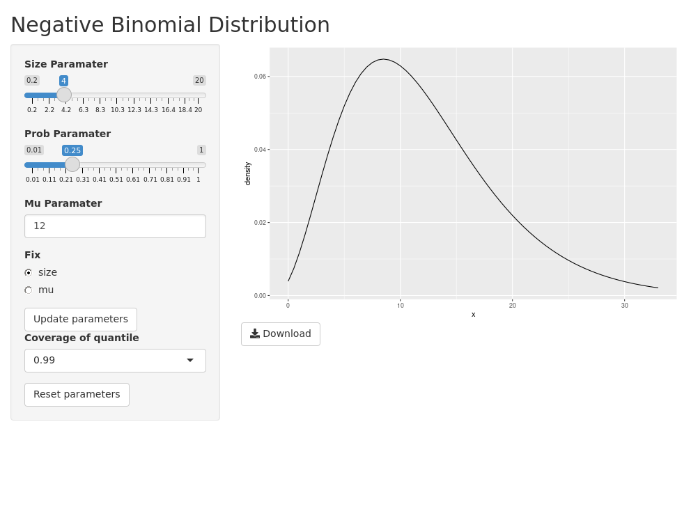

<!-- README.md is generated from README.Rmd. Please edit that file -->

```{r, include = FALSE}
knitr::opts_chunk$set(
  collapse = TRUE,
  comment = "#>",
  fig.path = "man/figures/README-",
  out.width = "100%"
)
```

# nbinomPlot

<!-- badges: start -->
[](https://lifecycle.r-lib.org/articles/stages.html#experimental)
[](https://github.com/zettsu-t/nbinomPlot/actions)
<!-- badges: end -->

The goal of nbinomPlot is to show an example of how to build, test, and deploy a production-grade Shiny app.



## Installation

``` r
devtools::install_github("zettsu-t/nbinomPlot")
```

## Example

This is a basic example that shows you how to launch the nbinomPlot app:

```{r example, echo = TRUE, eval = FALSE}
library(nbinomPlot)
run_app()
```

## Run on Shiny Server

Build and run a Docker container with **Dockerfile_shiny**

```{bash build, echo = TRUE, eval = FALSE}
docker build -f Dockerfile_shiny -t nbinom .
docker run -t nbinom
```

and you can access the nbinomPlot app at [http://example.com:3838/nbinomPlot](http://example.com:3838/nbinomPlot). Note that you have to replace the URL with an actual server.
